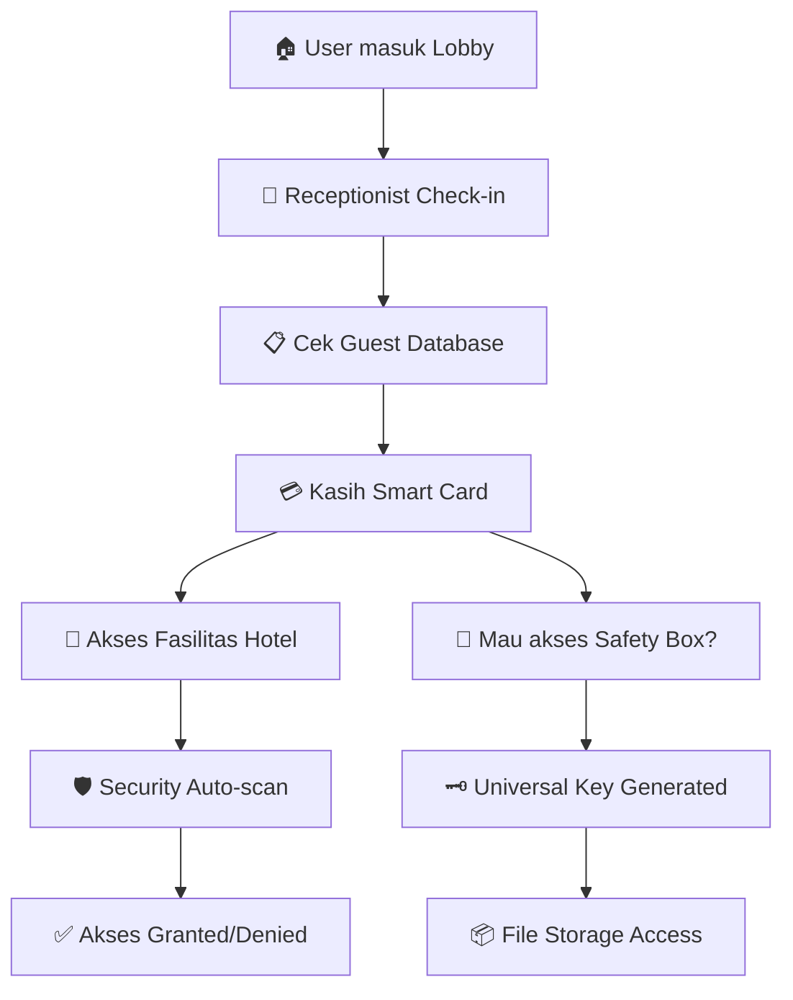

# 🏨 **DOKUMENTASI MIGRASI SISTEM LOGIN - ANALOGI HOTEL**

## 📋 **RINGKASAN MASALAH & SOLUSI**

### **🏨 ANALOGI: SISTEM KARTU AKSES HOTEL**

Bayangkan aplikasi kita seperti **hotel mewah** dengan berbagai fasilitas:
- **🏠 Lobby (Login Page)**: Tempat tamu check-in
- **🏃‍♂️ Lift & Koridor (Middleware)**: Security yang cek kartu akses
- **🚪 Kamar & Fasilitas (Protected Pages)**: Area yang butuh akses khusus
- **📁 Safety Deposit Box (File Storage)**: Tempat simpan dokumen pribadi

---

## 🔑 **MASALAH SISTEM LAMA (Custom Auth)**

### **Seperti Hotel dengan Sistem Kartu Buatan Sendiri:**

**🏨 Hotel Lama:**
- **Receptionist** bikin kartu akses **manual** pakai mesin fotocopy 📠
- **Security** harus **cek satu-satu** dengan daftar tamu di buku tulis 📖
- **Safety Box** punya **kunci terpisah** yang beda sama kartu kamar 🗝️
- **Staff** harus **ingat semua** prosedur khusus yang rumit 🤯

**❌ Masalah yang Terjadi:**
```
🔍 Problem 1: Kartu Akses Rumit
- Receptionist harus coding manual
- Proses check-in lama dan error-prone

🔍 Problem 2: Security Check Lambat  
- Security harus cek database manual
- Middleware ribet dan sulit maintain

🔍 Problem 3: Safety Box Tidak Terintegrasi
- File upload butuh proses autentikasi terpisah
- User harus "double check-in" untuk akses storage
```

---

## ✅ **SOLUSI SISTEM BARU (NextAuth)**

### **Seperti Hotel dengan Sistem Kartu Modern:**

**🏨 Hotel Modern:**
- **System Integrated** 🏩: Satu sistem untuk semua (NextAuth)
- **Smart Card** 💳: Kartu pintar yang otomatis (NextAuth Session)
- **Auto Security** 🛡️: RFID scanner otomatis di setiap pintu (Middleware)
- **Universal Access** 🗝️: Satu kartu untuk kamar + safety box (JWT Bridge)

**✅ Keuntungan Sistem Baru:**
```
🎯 Benefit 1: Check-in Otomatis
- NextAuth handle semua proses login
- Standard industry, proven & secure

🎯 Benefit 2: Security Terintegrasi
- Middleware otomatis cek session
- Role-based access control tetap berjalan

🎯 Benefit 3: Universal Card Access
- Satu session untuk semua fitur
- File upload pakai JWT Bridge yang aman
```

---

## 🔧 **TECHNICAL IMPLEMENTATION**

### **🏗️ KOMPONEN SISTEM (Hotel Analogy)**

| Hotel Component | Technical Component | Fungsi |
|----------------|-------------------|-------|
| **🏨 Hotel Management System** | **NextAuth Configuration** | Central auth system |
| **👤 Receptionist** | **Login Form + signIn()** | User authentication |
| **💳 Smart Card** | **NextAuth Session** | User identity & permissions |
| **🛡️ Security Scanner** | **Middleware** | Route protection |
| **🗝️ Universal Key** | **JWT Bridge** | File storage access |
| **📋 Guest Database** | **user_universal Table** | User data storage |

### **🔄 ALUR KERJA SISTEM**



### **📝 STEP-BY-STEP IMPLEMENTASI**

#### **Step 1: Setup Hotel Management System**
```bash
# Install NextAuth (Hotel Management Software)
npm install next-auth@beta @auth/core
```

#### **Step 2: Configure Receptionist System**
```typescript
// auth.ts - Setup receptionist procedures
export const { handlers, signIn, signOut, auth } = NextAuth({
  providers: [
    Credentials({
      // Cek guest database (user_universal table)
      async authorize(credentials) {
        // Query ke Supabase user_universal table
        // Verify password dengan bcrypt
        // Return user data jika valid
      }
    })
  ]
})
```

#### **Step 3: Update Security System**
```typescript
// middleware.ts - Smart security scanner
export default async function middleware(request: NextRequest) {
  // Try NextAuth session first (smart card)
  const session = await auth();
  
  // Fallback to legacy system (manual check)
  if (!session) {
    const legacySession = await getSessionFromRequest(request);
  }
  
  // Role-based access control
  if (userRole === 'super_admin') {
    // VIP access to all facilities
  } else if (userRole === 'database_tutor_manager') {
    // Limited access to specific areas
  }
}
```

#### **Step 4: Universal Key System**
```typescript
// /api/supabase-session - Universal key generator
export async function GET() {
  // Get session from either NextAuth or legacy
  const session = await nextAuth() || await customAuth();
  
  // Generate universal key (JWT) for safety box
  const universalKey = await new SignJWT({
    sub: session.user.id,
    role: "authenticated"
  }).sign(secret);
  
  return { supabaseToken: universalKey };
}
```

---

## 🎯 **HASIL AKHIR**

### **🏨 Hotel Experience: Before vs After**

| Aspect | 🔴 Before (Custom) | 🟢 After (NextAuth) |
|--------|------------------|-------------------|
| **Check-in Process** | Manual, error-prone | Otomatis, standard |
| **Security Check** | Lambat, ribet | Instant RFID scan |
| **Safety Box Access** | Perlu kunci terpisah | Universal card |
| **Staff Training** | Rumit, custom | Industry standard |
| **Guest Experience** | Inconsistent | Smooth & professional |
| **Maintenance** | High effort | Low maintenance |

### **📊 BENEFITS ACHIEVED**

✅ **User Experience**: Sama seperti sebelumnya, tapi lebih reliable  
✅ **Data Consistency**: Tetap pakai `user_universal` table  
✅ **Security**: Role-based access control tetap berjalan  
✅ **File Upload**: JWT Bridge ready untuk Supabase Storage  
✅ **Maintainability**: Standard NextAuth, mudah di-maintain  
✅ **Scalability**: Siap untuk fitur auth tambahan (OAuth, etc.)

---

## 🛠️ **TROUBLESHOOTING GUIDE**

### **🔍 Common Issues & Solutions**

#### **Problem: Double Locale Prefix**
```
❌ URL jadi: /en/en/dashboard
✅ Fix: Remove hard-coded locale dari redirect
```

#### **Problem: Session Not Found**
```
❌ Middleware tidak dapat session
✅ Check: NextAuth configuration & environment variables
```

#### **Problem: File Upload Gagal**
```
❌ Supabase storage access denied
✅ Check: JWT Bridge API & RLS policies
```

---

## 📚 **REFERENCES & NEXT STEPS**

### **🔗 Related Documentation**
- `supabase-storage-rls-policies.sql` - File storage security setup
- `auth.ts` - NextAuth configuration
- `middleware.ts` - Route protection logic

### **🚀 Future Enhancements**
- **OAuth Integration**: Google/GitHub login
- **Multi-factor Authentication**: Extra security layer  
- **Session Management**: Advanced session controls
- **Audit Logging**: Track authentication events

---

## 👥 **UNTUK TEAM DEVELOPMENT**

### **🎓 Knowledge Transfer**
```
💡 Tip: NextAuth seperti upgrade dari sistem manual ke otomatis
- Lebih mudah di-maintain
- Industry standard approach
- Dokumentasi lengkap tersedia online
- Community support yang besar
```

### **🔧 Maintenance Mode**
```
✅ Sistem production-ready
✅ Backward compatibility terjaga
✅ Error handling comprehensive
✅ Logging & debugging tersedia
```

---

**🎉 CONGRATULATIONS! Hotel management system upgrade complete!** 🏨✨